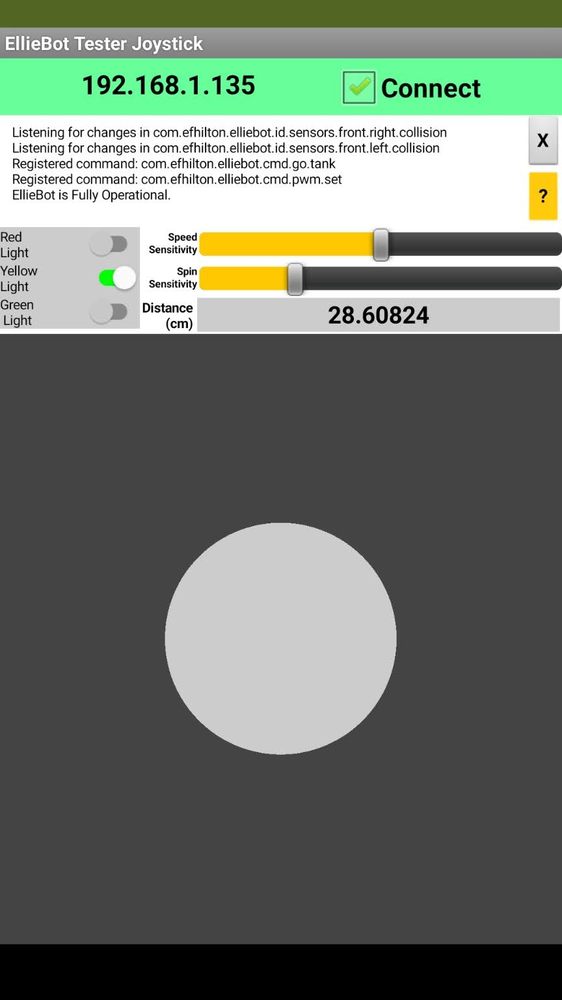

# EllieBotBlue
This project gives the CamJam EduKit 3 (or any other Raspberry Pi enabled robot) the ability to communicate with a remote application via an MQTT broker.  

## Introduction
This project allows the control of a Cam Jam EduKit 3 through an MQTT message broker. 

This project was created so that I can teach kids how to program on their tablet using either Thunkable or MIT App Inventor.  The idea is to have them use Scratch from tehir tablet to control their robot 

## Setting Up Your Robot

To get this code up and running, you will need:

- **An Assembled Robot**: I used the CamJam EduKit 3, which uses double H-Bridges to control the motors.
- **A Raspberry Pi**: I've been using a Raspberry Pi 3B+ with lots of success
- **An MQTT Message Broker**: It can be running either locally in the robot (such as mosquitto) or in a remote server, accessible to all devices. 
- **Dotnet Core 3.1 installed in the Raspberry Pi**: This is needed to both compile and publish the executables.

### Installing MQTT

To install the mosquitto server and client in your Raspberry Pi, just install both the server and client:

```BASH
sudo apt-get install mosquitto mosquitto-clients
```

### Installing DotNet

To install `dotnet` in your Raspberry Pi, follow the instructions found [here](https://docs.microsoft.com/en-us/dotnet/iot/deployment).

### Compiling the Code

To build the code, simply do the following:

```BASH
cd /your/project/directory
dotnet build
dotnet publish -o /your/target/directory
```
For example, assuming that the source code is located in the `~/BlueCamJam` folder, and that you want to place the excutable in a folder named `~/Elliebot` do:

```BASH
cd ~/BlueCamJam
dotnet build
dotnet publish -o ~/EllieBot
```

This will create a folder in your home directory named `EllieBot`. In it, you will find the executable. 

### Configuring Your Robot

To configure your robot, run the `EllieBot` executable for the first time to create a default configuration file.

To do so, simply type:

```BASH
~/EllieBot/EllieBot
```

If this is your first time running EllieBot, then you will see it print a message, create a configuration file, and exit.  You can find the configuration file in `~/EllieBot/robot_config.json`.

The `robot_config.json` file is used to configure your robot. Please make sure that the settings match your hardware. Failure to do so could damage your robot!

Your configuration file will probably look something like this:

```JSON
{
  "BackbonePort": 1883,
  "BackboneServer": "localhost",
  "LeftMotorBackwardPin": 7,
  "LeftMotorForwardPin": 8,
  "RightMotorBackwardPin": 9,
  "RightMotorForwardPin": 10,
  "TopicForCommands": "com.efhilton.elliebot.commands"
}
```
Here, the settings are as follows:

| Setting | Default | Description | 
| --- | ---| --- | 
| BackbonePort | 1883 | The port via which to connect to the MQTT broker | 
| BackboneServer | localhost | The server hosting the MQTT broker (it could be local or remote) |
| TopicForCommands | com.efhilton.elliebot.commands | The MQTT topic via which commands will be received |
| LeftMotorForwardPin | 8 | The GPIO pin which will drive the Left motor forward | 
| LeftMotorBackwardPin | 7 | The GPIO pin which will drive the Left motor backward | 
| RightMotorForwardPin | 10| The GPIO pin which will drive the Right motor forward | 
| RightMotorBackwardPin | 9 | The GPIO pin which will drive the Right motor backward | 

:warning: **WARNING**: For simplicity, and with the assumption that this code is running inside a controlled network, all security mechanisms have been disabled. You have been warned!

## Running The Code

Once you've configured your robot as described above, you are ready to run the code.

To do so, simply type:

```BASH
~/EllieBot/EllieBot
```

Your robot is now ready to receive commands.

## Commanding Your Robot

This section describes the syntax needed to command your robot.

### General Command Syntax

Commands are sent as text over MQTT. They have the syntax as follows:

```JSON
{
    "Command":"<some command>",
    "Arguments": [
        "<arg1>", ... , "<argN>"
    ]
}
```

For example, to control the left and right motors independently (for example during debugging), simply supply a duty cycle of say 50% and -50% to both the left and right motors, respectively, by using the `GO_RAW` command as follows:

```JSON
{
    "Command":"GO_RAW",
    "Arguments": [
        "0.5","-0.5"
    ]
}
```
Here, the left motor will drive forward at 50% duty cycle, and the right motor will drive backwards at 50% duty cycle, thus turning the robot around its vertical axis in the clockwise direction.

### Commands

The following commands are recognized by the robot.

| Command | Arguments | Example | Description |
| --- | --- | --- | --- | 
| `GO_RAW` | `<left_dutycycle>,<right_dutycycle>`| `{"Command":"GO_RAW", "Arguments": ["0.5","-0.5"]}`| Sets the duty cycles for both he left and right motors.  Accepted values are from -1 to 1, where negative numbers represent driving the motors backwards, and positive numbers will drive the motors forwards.|
| `GO_TANK` | `<forward_effort>,<ccw_effort>`| `{"Command":"GO_TANK", "Arguments": ["0.5","-0.5"]}`| Sets the forward speed of the robot as well as the rate of rotation.  For example, setting the `<forward_effort>` to zero, and the `<ccw_effort>` to one will cause the robot to spin counterclockwise about its vertical axis only.  Acceptable values range from `[-1, 1]` for both arguments.|
| `GO_INTERP` | `<cmd_string>,<abs_dutycycle>`| `{"Command":"GO_INTERP", "Arguments": ["LEFT","0.5"]}`| Sets an action for the robot to take.  Valid `<cmd_string>` options are `"LEFT"`, `"RIGHT"`, `"FORWARD"`, `"BACKWARD"`, `"STOP"`.  The `<abs_dutycycle>` argument will dictate how much effort to use on this command.  Note that the argument to `"STOP"` is needed, though it will be ignored. Otherwise, arguments should be in the range of `[-1,1]`.|

## Client Code, MIT App Inventor

A quick way to test out your robot is to create a simple application in MIT App Inventor.  

Here, I created a simple joystick application which makes use of the `GO_TANK` command. I had a lot of fun driving this robot all around the house, using my phone. I drove it around all forms of obstacles, and timed myself as a personal challenge.

The Design screen looks as follows: 

I used:
- the built in "Ball" widget, used that as the joystick's head. You drag the ball across the screen, and its relative position from center is converted into control signals for the robot.  
- a text box to enter the IP address of the robot
- a checkbox to connect and disconnect from the robot
- two sliders, which I use to control the horizontal and vertical sensitivity of the joystick
- the `UrsPahoMqttClient`, which is a fantastic little MQTT client plugin that you can download from the [Ullis Roboter Seite](https://ullisroboterseite.de/android-AI2-PahoMQTT-en.html).

The blocks for this project are as follows .  

## License
This project is governed by the MIT License. All rights reserved.

## Author
The main author for this project is Edgar Hilton, edgar.hilton@gmail.com.

## Questions?
Please don't hesitate to reach out to me, edgar.hilton@gmail.com if you have any questions, comments, or ideas on how to enhance this project.

## Buy Me Coffee?
If you find this code useful, or if you want to feed my growing love of Raspberry Pi hardware, or if you want to buy me a cup of coffee (I like Starbucks!) as a way of saying thanks, then consider making a Paypal donation to [my Paypal](http://paypal.com.me/mighty2020).
